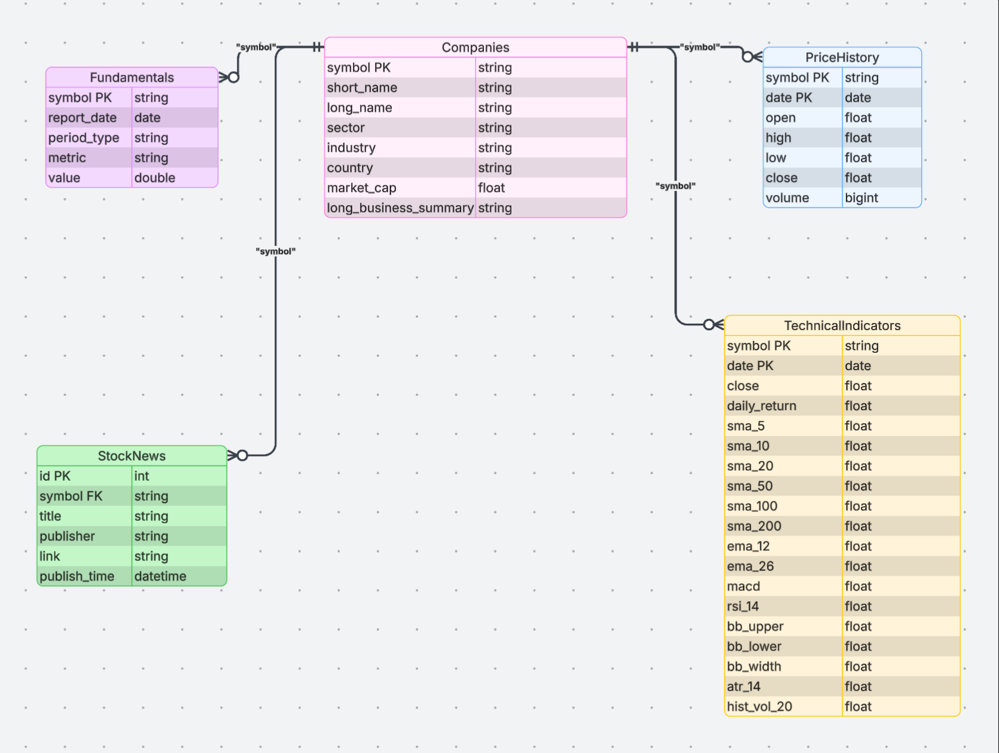
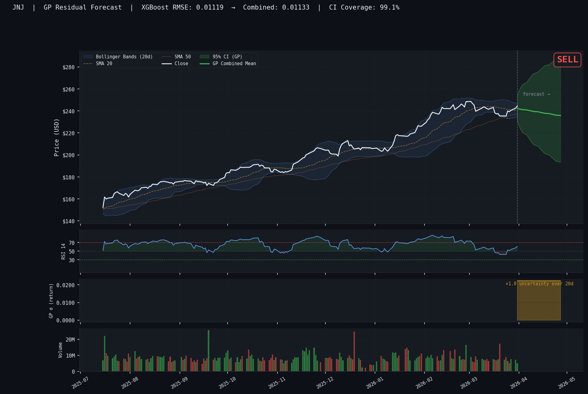

# DS 4320 Project 1: Stock Market Probabilistic Forecasting Model

#### Landon Burtle (xfd3tf)
#### License - [MIT](LICENSE)
#### Press Release - [Stop Guessing, Start Understanding: A Smarter Way to Read the Stock Market](PRESSRELEASE.md)
#### DOI - [](https://doi.org/10.5281/zenodo.19364787)

### Executive Summary

Basic Machine Learning models geared towards forecasting stock market prices tend to fail or not be useful due to a number of reasons. 
One of those reasons that this project is focused on is the importance in quantifying uncertainty, as well as solely utilizing numerical data.

My project aims to implement these missing features to better understand when the model does or does not know confidently where the stock price is moving.
To implement this, I pulled data from Yahoo Finance's API, ```yfinance```, which included information on the companies as well as their stock metrics, alongside
news articles from the Yahoo Finance page for current event sentiment analysis. To avoid overcomplicating and save compute time, I opted to use a proxy for a sentiment map rather than implementing a tool such as FinBERT. These scores were attached to the stock data and fed into an XGBoost model to build residual fits, then into a Sparse Variational Gaussian Process (SVGP) model to fit the data and quantify uncertainty. This allowed for taking the posterior and sampling for future forecasts.

This solution effectively targets multiple aspects that are missing in basic ML applications for stock market forecasting. It has not been backtested
for training strategy effectiveness, but most importantly it does learn to build cones of uncertainty to predict future prices, incorporating the 
non-numerical data of sentiment in a numerical manner. 

This repository contains the scripts that were used for building the pipeline, contained in **`scripts/`**, which is assembled in `problemsolution.ipynb`. The results are visualized in the **`plots/`** folder. The **`images`** folder contains any extraneous media, which is just the `projectERD.png` displayed below.

### Data

Data folder: [OneDrive Link](https://myuva-my.sharepoint.com/:f:/g/personal/xfd3tf_virginia_edu/IgAnw5dHMOZ-RoqYzN135Y2bASnRxuDLPszFfxa-YQXSFms?e=cSlCmL)

Repo Structure

```
.
├── LICENSE
├── README.md
├── compute_uncertainty.ipynb
├── images
│   └── projectERD.PNG
├── plots
│   ├── calibration.png
│   ├── rmse_improvement.png
│   ├── signal_distribution.png
│   ├── ticker_AAPL.png
│   ├── ticker_AMZN.png
│   ├── ticker_BAC.png
│   ├── ticker_CVX.png
│   ├── ticker_GOOG.png
│   ├── ticker_JNJ.png
│   ├── ticker_JPM.png
│   ├── ticker_MSFT.png
│   ├── ticker_NVDA.png
│   ├── ticker_UNH.png
│   ├── ticker_XOM.png
│   └── uncertainty_landscape.png
├── problemsolution.ipynb
├── requirements.txt
└── scripts
    ├── data.py
    ├── model.py
    └── visualize.py
```

### Pipeline
Built with the files [data.py](scripts/data.py), [model.py](scripts/model.py), and [visualize.py](scripts/visualize.py)
```
scripts
├── data.py
├── model.py
└── visualize.py
```
Compiled and ran in [problemsolution.ipynb](problemsolution.ipynb)

-------------------
## Problem Definition

### Initial General Problem
Can we predict the price of a stock?
### Refined Problem Statement
Can we forecast where a stock closing price is moving with a degree of confidence?
### Rationale
"Predicting the price of a stock" is very vague as there are multiple values which that could represent. We could consider the opening price, closing price, price during the day while its being traded, or maybe even relative change. Because of this, I choose to simply forecast the closing price since this allows a trader/investor to inform their decisions on where the value will be at the end of the trading day, or at some future date. Forecasting the price throughout the day is only of interest to traders who trade throughout the day, but that is a smaller base of interest so instead we can just appeal to longer-term investors. Another important factor to investors when it comes to machine-informed decisions is uncertainty. If we can express how certain a model is in its predictions, we can more thoroughly evaluate whether it is valuable or not.
### Motivation
Unlike the previous problem, this is not a data problem. There is a lot of collected data every day and every minute from the stock market, available on many APIs. The reason this is an intriguing problem is because it requires harnessing data with lots of inherent noise, making it difficult to read, and require some method to finding the underlying trend. On the other hand, it is very interesting to investors who want to have some verified successful method to reading the market and making profits off of it.
### Headline
Probabilistic Approach to Forecasting Stock Prices allows for Better Insights [Link](Change_This)

--------------------
## Domain Exposition

### Terminology:

#### KPI/Jargon:
| Term | Definition |
| --- | --- |
| Returns (KPI) | Amount made back on investments |
| Profit (KPI) | Net gain on investments |
| YTD | Year-to-date |
| Indicator | Calculated feature for finding the signal in a stock |
| RSI | Relative Strength Index. Indicator for stocks. |
| MACD | Moving Average Convergence Divergence. Another indicator which measures the strength of a trend |
| Signal | Underlying true trend of the data |
| ML | Machine Learning |
| DL | Deep Learning |

### Domain:
This project lives in the domain of Quantitative Investment and Machine Learning, as well as general Finance and Economics. Much of the important topics for understanding include an understanding of markets and market dynamics as well as data and knowing the difference between signal and noise. Being able to engineer valuable indicator features is also a data skill which is valued in the domain.

### Background Reading:

| Article | Summary | Link |
| --- | --- | --- |
| Efficient Market Hypothesis | Describes how in theory it is impossible to predict the market in the scenario that the market is always perfectly priced, so there is no margin to gain. | [Efficient Market](https://drive.google.com/file/d/1wPENRU4HO7Im4GskrUa2NVkDwodG0BTk/view?usp=sharing) |
| Oscillators: MACD, RSI, Stochastics | Explores the surface level of technical indicators which detect the strength of a trend to determine if a market is over-bought or over-sold | [Oscillators](https://drive.google.com/file/d/1GCqNkxv06inuFfWi-cFaDv5br3gV6GnW/view?usp=sharing) |
| Stock Market Prediction Using Machine Learning and Deep Learning Techniques: A Review | A deeper dive on machine learning techniques that have been used for stock market prediction such as LSTMs, CNNs and SVMs. | [MLDL](https://drive.google.com/file/d/1qnITIEKcQIXsNt7Y3DlppfE6lEd-b4OK/view?usp=sharing) |
| Stock Price Prediction in the Financial Market Using Machine Learning Models | Another exploration of the applications of ML models for stock price prediction, specifically regarding time series data, such as with RNNs, LSTMs, GRU, CNNs, and XGBoost | [ML](https://drive.google.com/file/d/1iDBPMujGTRJcV5POJ1EKliOCa2YetyfW/view?usp=sharing) |
| Uncertainty in time series forecasting | Discusses randomness and uncertainty as key features of the data, requiring degrees of confidence and Bayesian methods for better capturing the data | [Uncertainty](https://drive.google.com/file/d/1Hc1d3PzOdhoIosIhWQNyNzLSw0cYXAXo/view?usp=sharing) |

Folder link: [Complete Folder](https://drive.google.com/drive/folders/1GtwGSTOvyQ1R31vCpp-Y5rtdQj4u8XeA?usp=drive_link)

----------------------
## Data Creation

All data in this project is sourced from live, publicly available financial data providers.

The list of companies to analyze was obtained by scraping the S&P 500 constituent table from Wikipedia (`https://en.wikipedia.org/wiki/List_of_S%26P_500_companies`). Wikipedia was chosen over direct financial-aggregator scraping because aggregators (e.g., Slickcharts, Macrotrends) frequently return HTTP 403 errors when accessed through a script.

The core financial data was retrieved using the yfinance library, which wraps Yahoo Finance's unofficial API. For each ticker, three categories of data were pulled ticker.info, ticker.history(period='max', auto_adjust=True) and the financial statements — `income_stmt`, `balance_sheet`, `cash_flow`, and their quarterly counterparts.

Unstructured text data was collected from Yahoo Finance's public RSS feed (`https://feeds.finance.yahoo.com/rss/2.0/headline?s={symbol}`), which returns the most recent ~30 headlines per ticker as XML. The feed is unauthenticated and publicly accessible.

Technical Indicators were computed entirely from the price history data using pandas `.rolling()` and `.ewm()` methods.

| File | Description | Link |
|------|-------------|------|
| `data.py` | Main ETL pipeline: ticker ingestion, yfinance extraction, technical indicator computation, fundamentals stacking, RSS news fetch, DuckDB load, Parquet export, and verification queries | [data.py](financial_pipeline.py) |

### Bias:
**Survivorship Bias:** The tickers listed are the current S&P 500 constituents. Companies that were once in the index but were later removed due to bankruptcy, 
merger, or sustained underperformance are absent from the dataset. This means the historical price data is implicitly drawn only from companies that survived 
long enough to remain index members, systematically overstating historical average returns and understating historical average volatility.

### Bias Mitigation:
The clearest mitigation is to supplement the dataset with delisted tickers (e.g., from CRSP or Compustat). In this project, the bias can be partially quantified
by filtering analyses to the subset of the price history that predates each company's index entry date. Any forecasting model should be evaluated with out-of-sample
data from a future index reconstitution to test whether returns generalize beyond survivors.

### Rationale:
Several commonly referenced S&P 500 CSV sources (e.g., from GitHub) return 403 errors when fetched programmatically. Wikipedia's table is publicly accessible, 
human-readable, and updated within days of index changes. The dot-to-hyphen substitution (`BRK.B → BRK-B`) is required because Yahoo Finance uses hyphens in 
ticker symbols while the S&P 500 official list uses dots.

---------------------
## Metadata



### Data:
| Table | Description | CSV / Parquet |
|-------|-------------|---------------|
| `Companies` | One row per ticker — name, sector, industry, market cap, long business summary text | [Companies.parquet](https://myuva-my.sharepoint.com/:u:/g/personal/xfd3tf_virginia_edu/IQCuQ9dEts44R4VhcgLinkuIAZXpkMVL0BgzVrCTZotX1uA?e=xaZb2U) |
| `PriceHistory` | Daily OHLCV records from IPO date to present, one row per (symbol, date) | [PriceHistory.parquet](https://myuva-my.sharepoint.com/:u:/g/personal/xfd3tf_virginia_edu/IQD8aNE7ny28TL_31jIpa4vwASjvEOYxPLPJ7KYFUr8jye8?e=SoXGis) |
| `Fundamentals` | Long-format financial statement metrics — income, balance sheet, cash flow; annual and quarterly | [Fundamentals.parquet](https://myuva-my.sharepoint.com/:u:/g/personal/xfd3tf_virginia_edu/IQBIhKOMrz1DTrMnYwDNSdiLAX3fMempSR4aTaLRkceAfTc?e=sk1R32) |
| `TechnicalIndicators` | 20+ engineered features per (symbol, date): SMAs, EMAs, MACD, RSI, Bollinger Bands, ATR, volatility | [TechnicalIndicators.parquet](Change_this) |
| `StockNews` | Real news headlines from Yahoo Finance RSS: title, publisher, link, publish timestamp | [StockNews.parquet](https://myuva-my.sharepoint.com/:u:/g/personal/xfd3tf_virginia_edu/IQByAJy3UVk-SLZHAgKQI8oWAW6G9aWPSY1RHE42BaxH6mU?e=2Ho8QK) |


### Data Dictionary:
#### Companies
| Feature | Type | Description | Example |
|---------|------|-------------|--------|
| symbol | VARCHAR (PK) | Ticker symbol as used on Yahoo Finance | `AAPL` |
| short_name | VARCHAR | Abbreviated company name | `Apple Inc.` |
| long_name | VARCHAR | Full legal company name | `Apple Inc.` |
| sector | VARCHAR | GICS sector classification | `Technology` |
| industry | VARCHAR | GICS industry sub-classification | `Consumer Electronics` |
| country | VARCHAR | Country of incorporation | `United States` |
| exchange | VARCHAR | Primary listing exchange | `NMS` |
| market_cap | BIGINT | Total market capitalisation in USD | `2950000000000` |
| full_time_employees | INTEGER | Number of full-time staff | `150000` |
| website | VARCHAR | Corporate website URL | `https://www.apple.com` |
| long_business_summary | TEXT | Multi-paragraph business description (intentionally large) | `Apple Inc. designs, manufactures...` |
| fetched_at | TIMESTAMP | UTC timestamp of data retrieval | `2026-03-23 14:30:00` |

#### PriceHistory
| Feature | Type | Description | Example |
|---------|------|-------------|--------|
| symbol | VARCHAR (PK) | Ticker symbol | `AAPL` |
| date | DATE (PK) | Trading date | `2024-01-15` |
| open | DOUBLE | Opening price (adjusted) | `185.23` |
| high | DOUBLE | Intraday high (adjusted) | `186.90` |
| low | DOUBLE | Intraday low (adjusted) | `184.10` |
| close | DOUBLE | Closing price (adjusted) | `186.40` |
| volume | BIGINT | Shares traded (INT64 to avoid overflow) | `58432100` |
| adj_close | DOUBLE | Dividend and split-adjusted close | `186.40` |

#### Fundamentals
| Feature | Type | Description | Example |
|---------|------|-------------|--------|
| symbol | VARCHAR (PK) | Ticker symbol | `AAPL` |
| report_date | DATE (PK) | End date of the reporting period | `2024-09-28` |
| period_type | VARCHAR (PK) | Reporting frequency | `annual` or `quarterly` |
| metric | VARCHAR (PK) | Financial metric name from Yahoo Finance | `TotalRevenue` |
| value | DOUBLE | Reported value in USD | `391035000000.0` |

#### TechnicalIndicators
| Feature | Type | Description | Example |
|---------|------|-------------|--------|
| symbol | VARCHAR (PK) | Ticker symbol | `AAPL` |
| date | DATE (PK) | Trading date | `2024-01-15` |
| close | DOUBLE | Adjusted closing price | `186.40` |
| daily_return | DOUBLE | Simple daily return `(close/close_prev) - 1` | `0.00612` |
| log_return | DOUBLE | Natural log return `ln(close/close_prev)` | `0.00610` |
| cumulative_return | DOUBLE | Compounded return since first available date | `1.8342` |
| sma_5 | DOUBLE | 5-day simple moving average | `185.80` |
| sma_10 | DOUBLE | 10-day simple moving average | `184.20` |
| sma_20 | DOUBLE | 20-day simple moving average | `183.50` |
| sma_50 | DOUBLE | 50-day simple moving average | `180.10` |
| sma_200 | DOUBLE | 200-day simple moving average | `175.60` |
| ema_12 | DOUBLE | 12-day exponential moving average | `185.10` |
| ema_26 | DOUBLE | 26-day exponential moving average | `183.40` |
| ema_50 | DOUBLE | 50-day exponential moving average | `181.20` |
| macd | DOUBLE | MACD line `ema_12 - ema_26` | `1.70` |
| macd_signal | DOUBLE | 9-day EMA of MACD | `1.45` |
| macd_histogram | DOUBLE | `macd - macd_signal` | `0.25` |
| bb_upper | DOUBLE | Bollinger Band upper (20-day SMA + 2σ) | `190.20` |
| bb_middle | DOUBLE | Bollinger Band middle (20-day SMA) | `183.50` |
| bb_lower | DOUBLE | Bollinger Band lower (20-day SMA − 2σ) | `176.80` |
| bb_width | DOUBLE | Band width `(upper-lower)/middle` | `0.073` |
| bb_pct_b | DOUBLE | %B position `(close-lower)/(upper-lower)` | `0.71` |
| rsi_14 | DOUBLE | 14-day RSI (Wilder smoothing via ewm) | `63.4` |
| volume | BIGINT | Raw share volume (BIGINT) | `58432100` |
| volume_sma_20 | DOUBLE | 20-day average volume | `62100000.0` |
| volume_ratio | DOUBLE | `volume / volume_sma_20` | `0.941` |
| atr_14 | DOUBLE | 14-day Average True Range | `3.12` |
| hist_vol_20 | DOUBLE | 20-day historical volatility, annualised | `0.182` |

#### StockNews
| Feature | Type | Description | Example |
|---------|------|-------------|--------|
| id | INTEGER (PK) | Auto-incrementing row identifier | `1042` |
| symbol | VARCHAR | Ticker symbol the news was fetched for | `AAPL` |
| title | VARCHAR | Headline text from RSS feed | `Apple Reports Record Q1 Revenue` |
| publisher | VARCHAR | News source name | `Reuters` |
| link | VARCHAR | URL to full article | `https://finance.yahoo.com/...` |
| provider_publish_time | TIMESTAMP | UTC publication timestamp | `2026-03-20 13:45:00` |
| news_type | VARCHAR | Feed source type | `RSS` |
| fetched_at | TIMESTAMP | UTC timestamp of RSS retrieval | `2026-03-23 14:30:00` |


### Uncertainty Analysis:

| Feature | Metric | Value | Feasible |
| --- | --- | --- | --- |
| close / adj_close | Mean % rounding error (close vs adj_close) | 0.0000% | Yes |
| close | NULL rate | 0.00% | Yes |
| volume | Rows that would corrupt INT32 | 106 rows across 4 tickers | Yes |
| sma_200 |  NULL warm-up rows (% of total) | 2.29% | Yes |
| rsi_14 | Mean abs(EWM − Wilder) deviation | 0.0393 pts  (max 26.5879)  (AAPL) | Yes |
| rsi_14 | % rows within 0.5 pt of true Wilder RSI | 99.5% | Yes |
| bb_pct_b | Division-by-zero NULL rate (post warm-up) | 0.119392% | Yes |
| hist_vol_20 | Median / P95 / % rows > 1.0 | 0.2531 / 0.666 / 1.41% | Yes |
| full_time_employees | NULL rate (not disclosed by all companies) | 1.4% | Yes |
| value (Fundamentals) | GAAP vs. non-GAAP divergence | Requires Compustat / external benchmark | No — external data needed |
| market_cap | Intraday staleness (seconds since fetch) | Requires intraday tick feed | No — external data needed |


----------------------
## Problem Solution Pipeline

### Files
Jupyter Notebook: **`problemsolution.ipynb`** [Here](problem_solution.ipynb)
Markdown Version **`problemsolution.md`** [Here](problem_solution.md)

### Analysis Rationale

In my analysis, the first main consideration/choice that I made was in regard to the necessity to quantify uncertainty. In order to do that,
I included a Gaussian Process (GP) to generate uncertainty bands / distributions, which then enable for iterative forecasting from the last distribution.
Next, to include an ML method from our past DS ML courses, I included an XGBoost model, which also served as an initial layer for analyzing the raw data and producing a residual for the GP to work off of. I also made the GP a Sparse GP, which allows for a set number of inducing points, or points where the model
builds the distributions off of, which saved computation costs, as running it in a notebook takes several hours on my local machine.
Finally, because of this, I also did not include a sentiment analysis model, like FinBERT, since it would have to analyze news articles for 500 stock tickers, which 
would be tedious enough, on top of the hours of model training. Instead I chose to just implement a crude sentiment score assignment so that it 
could be quickly calculated for each article.

### Results Visualizations

For the visualizations, the main choice I made was with the individual stock ticker forecast visualizations. These showed the stock history of the stock along with
some technical indicators, such as Bollinger Bands to show the standard deviations away from the mean, Simple Moving Averages (SMA) and the actual close price. 
After the historical data, it then shows where it begins to forecast and generate a distribution of values for the prediction, and this forms a cone as the uncertainty compounds. This is an explicit detail to convey to anyone how the model expresses its uncertainty.

Example:


